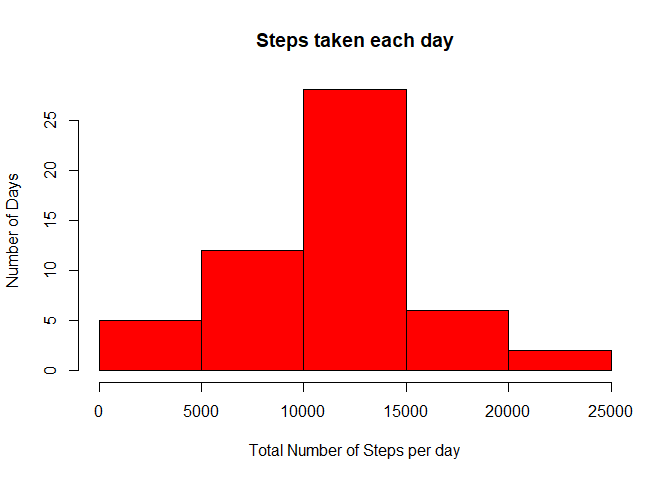

title: "Reproducible Research Assessment 1"
output: html_document


#Downloading file and processing Data
-----------------------------------------------------------------


```r
if(!file.exists("getdata-projectfiles-UCI HAR Dataset.zip")) {
        activity<- tempfile()
        download.file("http://d396qusza40orc.cloudfront.net/repdata%2Fdata%2Factivity.zip",activity)
        unzip(activity)
        unlink(activity)
}
activity<- read.csv("activity.csv", header = TRUE)
```

Let's check few Parameters


```r
head(activity)
```

```
##   steps       date interval
## 1    NA 2012-10-01        0
## 2    NA 2012-10-01        5
## 3    NA 2012-10-01       10
## 4    NA 2012-10-01       15
## 5    NA 2012-10-01       20
## 6    NA 2012-10-01       25
```

```r
summary(activity)
```

```
##      steps                date          interval     
##  Min.   :  0.00   2012-10-01:  288   Min.   :   0.0  
##  1st Qu.:  0.00   2012-10-02:  288   1st Qu.: 588.8  
##  Median :  0.00   2012-10-03:  288   Median :1177.5  
##  Mean   : 37.38   2012-10-04:  288   Mean   :1177.5  
##  3rd Qu.: 12.00   2012-10-05:  288   3rd Qu.:1766.2  
##  Max.   :806.00   2012-10-06:  288   Max.   :2355.0  
##  NA's   :2304     (Other)   :15840
```

#What is mean total number of steps taken per day?
---------------------------------------------------
Calculate the total number of steps taken per day


```r
stepsperday<-aggregate(steps~date, activity, sum)
```

calculating Mean and Median of "steps per day"


```r
mean_step<-mean(stepsperday$steps)
mean_step
```

```
## [1] 10766.19
```

```r
median_steps<-median(stepsperday$steps)
median_steps
```

```
## [1] 10765
```

Plotting Histogram

```r
hist(stepsperday$steps,col= "red", xlab="Total Number of Steps per day", ylab="Number of Days",
     main="Steps taken each day")
```

<!-- -->

#What is the average daily activity pattern?
---------------------------------------------------
time series plot


```r
avgstepsbyinterval<-aggregate(steps~interval, activity, mean)
avgstepsbyinterval[which.max(avgstepsbyinterval[,2]),1]
```

```
## [1] 835
```

```r
with(avgstepsbyinterval, plot(interval, steps, type = "l",col= "blue"))
```

<!-- -->

#Imputing missing values
----------------------------------------------------
Calculate and report the total number of missing values in the dataset


```r
missingvalues<-is.na(activity[,1])
```
replacing missing values with median


```r
med<-median(avgstepsbyinterval$steps)
activityNew<-activity
activityNew[missingvalues,1]<-med
head(activityNew)
```

```
##      steps       date interval
## 1 34.11321 2012-10-01        0
## 2 34.11321 2012-10-01        5
## 3 34.11321 2012-10-01       10
## 4 34.11321 2012-10-01       15
## 5 34.11321 2012-10-01       20
## 6 34.11321 2012-10-01       25
```

Ploting histogram of the total number of steps taken each day 
after imputing missing values
 

```r
totalstepsperday1<-aggregate(steps~date, activityNew, sum)
hist(totalstepsperday1$steps,col = "blue", xlab="Total Steps per day", ylab="Days", 
     main="Number of Steps taken each day")
```

<!-- -->

calculating the mean and median total number of steps per day 
we first find total number of steps per day


```r
totalstepsperday1<-aggregate(steps~date, activityNew, sum)

Newmean_stepsimput<-mean(totalstepsperday1$steps)

Newmean_stepsimput
```

```
## [1] 10642.7
```

Median


```r
med_stepsimput<-median(totalstepsperday1$steps)

med_stepsimput
```

```
## [1] 10395
```

#Are there differences in activity patterns between weekdays and weekends?
-----------------------------------------------------------------------------

```r
library(dplyr)
```

```
## 
## Attaching package: 'dplyr'
```

```
## The following objects are masked from 'package:stats':
## 
##     filter, lag
```

```
## The following objects are masked from 'package:base':
## 
##     intersect, setdiff, setequal, union
```

```r
activityNew$date<-as.Date(activityNew$date)

activityNew2<-activityNew%>%
        mutate(dayType= ifelse(weekdays(activityNew$date)=="Saturday" 
                               | weekdays(activityNew$date)=="Sunday",
                               "Weekend", "Weekday"))
head(activityNew2)
```

```
##      steps       date interval dayType
## 1 34.11321 2012-10-01        0 Weekday
## 2 34.11321 2012-10-01        5 Weekday
## 3 34.11321 2012-10-01       10 Weekday
## 4 34.11321 2012-10-01       15 Weekday
## 5 34.11321 2012-10-01       20 Weekday
## 6 34.11321 2012-10-01       25 Weekday
```

Plot containing a time series plot (i.e. type = "l") of the 5-minute interval (x-axis) 
and the average number of steps taken,
averaged across all weekday days or weekend days (y-axis)


```r
library(lattice)
averageStepsperDaytypeAndinterval<-activityNew2 %>%
        group_by(dayType, interval) %>%
        summarize(averageStepByDay=sum(steps))

head(averageStepsperDaytypeAndinterval)
```

```
## # A tibble: 6 x 3
## # Groups:   dayType [1]
##   dayType interval averageStepByDay
##     <chr>    <int>            <dbl>
## 1 Weekday        0         295.6792
## 2 Weekday        5         222.6792
## 3 Weekday       10         211.6792
## 4 Weekday       15         212.6792
## 5 Weekday       20         208.6792
## 6 Weekday       25         263.6792
```

```r
with(averageStepsperDaytypeAndinterval, 
     xyplot(averageStepByDay ~ interval | dayType, 
            type = "l", col= "red",      
            main = "Total Number of Steps within Intervals by dayType",
            xlab = "Daily Intervals",
            ylab = "Average Number of Steps"))
```

<!-- -->


